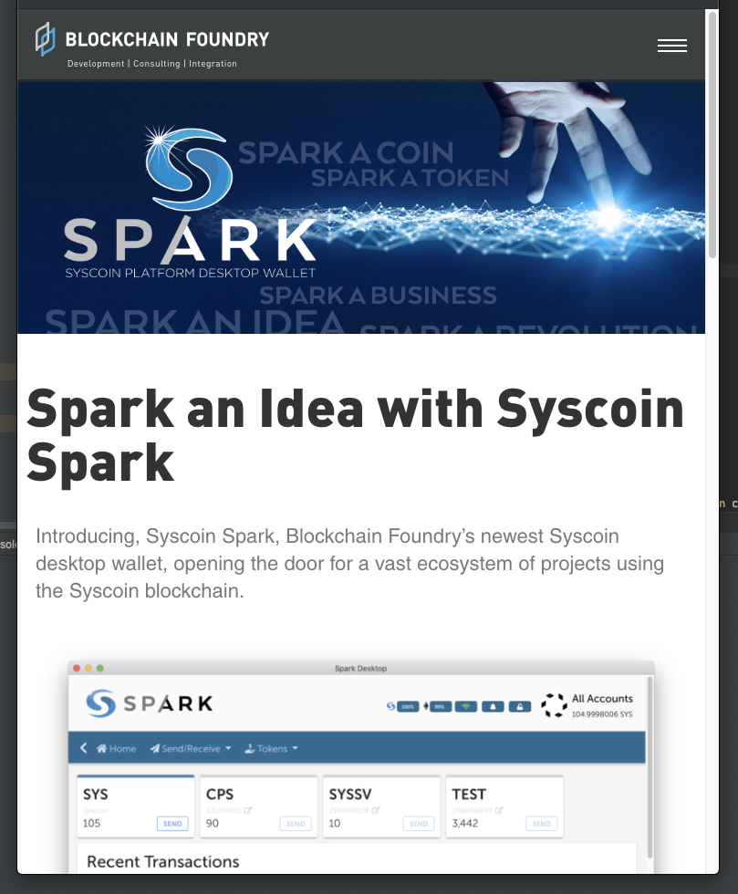

## Syscoin Spark Wallet
Welcome to the Spark Wallet by Blockchain Foundry Inc. [CSE:BCFN](https://thecse.com/en/listings/technology/blockchain-foundry-inc). This is a brandable wallet for [Syscoin](https://syscoin.org/) and [Syscoin Assets](https://syscoin.org/assets-tokens) useful for managing and transfering tokens across the [Syscoin](https://github.com/syscoin/syscoin) blockchain.

## Who is Blockchain Foundry Inc?

We started Blockchain Foundry as developers and founders of the [Syscoin](https://github.com/syscoin/syscoin) protocol and we wished to take part in the new economic revolution by helping transition and ready the business world which wishes to leverage transformative blockchain technology. We are agnositic to blockchain to help solve problems for businesses however we take what we learned over the course of the years working with this technology and apply it to our blockchain project [Syscoin](https://github.com/syscoin/syscoin) to help benefit those users without costly on-going business costs related to in-efficient designs or fees related to the blockchain itself.

## Why Syscoin?
We have spent over 5 years working and refining our protocol based on our learned experiences about using blockchain in efficient ways to benefit the bottom line for businesses today looking to take advantage of this game-changing technology introduced to us by [Bitcoin](https://github.com/bitcoin/bitcoin).

Syscoin takes advantage of Bitcoin's immense network security through [merged-mining](https://en.bitcoin.it/wiki/Merged_mining_specification). This means that your SYS and [SYS Assets](https://syscoin.org/assets-tokens) are secured through the Bitcoin mining network. We focused our attention to the [Syscoin](https://github.com/syscoin/syscoin) Asset protocol to ensure it is fast, efficient and cheap. Transferring [Syscoin](https://github.com/syscoin/syscoin) Asset Tokens leverage a patent-pending technology called [ZDAG](https://syscoin.org/zdag_syscoin_whitepaper.pdf) which is a micro-transaction layer ontop of the Proof-of-Work algorithm to allow for fast, real-time transactions to occur with a high probability of double-spend protection (read more about our performance here: https://syscoin.org/news/z-dag-performance-analysis). Bitcoin does not distinguish between micro and macro transactions and we bring to the market for the first time the ability to execute transactions at the scale the world needs yet still fallback to the security of the Bitcoin protocol should users choose to simply wait for Proof-of-Work on their transactions. The merchants receiving the Asset Tokens can make a choice between security and convenience understanding the high degree of probability that their micro-transaction is likely secure from being double-spent. This opens up a new form of a [fee-market](http://hackingdistributed.com/2019/01/22/doing-fees-right/) that brings transaction fees exponentially lower since users may not have to fight over being included into the next block, erasing the me-first syndrome that plagues Bitcoin causing fee's to go up anytime there is network congestion even though the transactions are for small amounts.

Think of [Syscoin](https://github.com/syscoin/syscoin) as an extension to [Bitcoin](https://github.com/bitcoin/bitcoin) following the same security domain and best practices but extending features which are demanded including [ZDAG](https://syscoin.org/zdag_syscoin_whitepaper.pdf) and the [SYSX bridge](https://github.com/syscoin/sysethereum-contracts).

By distinguishing between micro and macro transactions, merchants and consumers not longer have to worry about making small transactions on the L1 blockchain that will be cost prohibitive due to transaction fees.

L2 solutions such as [payment channels](https://lightning.network/) will supplement the L1 scaling solution by further reducing fees and increasing scalability whilst still providing an on-chain L1 solution should the payment channel solution not work for the consumer/merchant in a point-of-sale transaction.

In our recent iteration of [Syscoin 4](https://syscoin.org/) we not only hardened our Asset service bringing a production ready Tokenization platform to the world but we also created an interoptibility platform we call the SYSX bridge. The bridge currently interoperates with the [Ethereum](https://github.com/ethereum/go-ethereum) network as a trustless 0-counterparty bridge leveraging SPV proofs and an integrated [Ethereum](https://github.com/ethereum/go-ethereum) integration on [Syscoin](https://github.com/syscoin/syscoin) for a 2-way bridge between the blockchains. Read more here: https://github.com/syscoin/sysethereum-docs.

We set out to achieve a solution to scalability as well as interoptibility. In tomorrows world, we envision users and businesses leveraging blockchain to be able to choose the chain they wish to leverage for its features. [Syscoin](https://github.com/syscoin/syscoin) offers security, performance, cost-efficiency aswell as a non-custodial interoptibilty bridge for flexibility and interoptibility with external chains. [Syscoin](https://github.com/syscoin/syscoin) brings unique featuers that will be demanded by the business world to help their bottom-line.

## Asset protocol
You may issue tokens, mint, transfer, burn and move tokens over the SYSX bridge. For technical users please refer to the Asset protocol documentation: https://syscoin.readme.io/v4.0.0/docs/asset-creation

## Issues and Bugs
Please open up an issue on this Github if you find any issues (https://github.com/blockchainfoundryinc/syscoin-spark-wallet/issues), we will service your issue as soon as possible. Thank you for your contribution!
